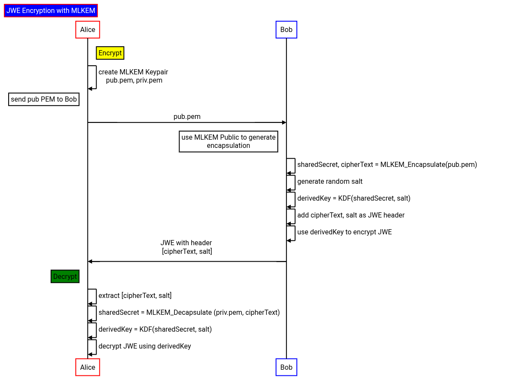

## Json Web Encryption (JWE) using Post Quantum Cryptography (ML-KEM)

Allows clients use `ML-KEM` keypairs for `Json Web Encryption (JWE)`.

This is basically hybrid encryption where an `ML-KEM` keypair's public key is used to generate a `sharedSecret` which afer a key derivation (`kdf(sharedSecret)`), its used as an `AES-GCM` encryption key ultimately used to encrypt the data.  The encrypted data in this context is used for JWE

This library also supports Google Cloud KMS's support for `ML-KEM`

>> NOTE: this library is note supported by Google; its alpha

Also see:

* [NIST Post-Quantum Cryptography Project](https://csrc.nist.gov/Projects/Post-Quantum-Cryptography)
* [crypto: post-quantum support roadmap](https://github.com/golang/go/issues/64537)
* Key Encapsulation [ML-KEM](https://csrc.nist.gov/pubs/fips/203/final)
* [Internet X.509 Public Key Infrastructure - Algorithm Identifiers for the Module-Lattice-Based Key-Encapsulation Mechanism (ML-KEM)](https://datatracker.ietf.org/doc/draft-ietf-lamps-kyber-certificates/08/)

- [Post-Quantum Cryptography (PQC) scratchpad](https://github.com/salrashid123/pqc_scratchpad)
- [AEAD encryption using Post Quantum Cryptography (ML-KEM)](https://github.com/salrashid123/go-pqc-wrapping)
- [Python AEAD encryption using Post Quantum Cryptography (ML-KEM)](https://github.com/salrashid123/python_pqc_wrapping)
- [golang-jwt for post quantum cryptography](https://github.com/salrashid123/golang-jwt-pqc)

Please note that this repo is alpha and I may adapt it to account for the following (i.,e support `alg: ML-KEM-768` vs what is currently `alg: dir`)

- [Post-Quantum Key Encapsulation Mechanisms (PQ KEMs) for JOSE and COSE](https://datatracker.ietf.org/doc/draft-ietf-jose-pqc-kem/)
- [Use of Hybrid Public Key Encryption (HPKE) with JSON Web Encryption (JWE)](https://datatracker.ietf.org/doc/draft-ietf-jose-hpke-encrypt/)

>> **WARNING** Please note later on the keyFormat may adopt [rfc9629](https://datatracker.ietf.org/doc/rfc9629/) if/when officially approved.  Inother words, instead of the proto, 

---

* [Overview](#overview)
  - [Key Generation](#key-generation)
- [JWE](#jew)
  - [Encrypt](#encrypt)
  - [Decrypt](#decrypt)
  - [Example](#example)  
* [GCP KMS](#gcp-kms)
* [JWT](#jwt)
* [Openssl key formats](#openssl-key-formats)
* [References](#references)

---

## Usage

If you want to encrypt data intended for a remote system, the remote system must first generate an `ML-KEM` key pair and share the public key

If Bob wants to encrypt data for Alice

1. Alice generates `MK-KEM` keypair (`pub.pem`, `priv.pem`)

2. Alice shares public key `pub.pem` with Bob

Encrypt (Bob):

3. generate encapsulation data using `pub.pem`
   
   `kemSharedSecret, kemCipherText = ML_KEM_Encapsulate( pub.pem )` 

4. Derive a new key using `kemSharedSecret` and a random salt. Use this AEAD key to encrypt `plainText`

   `derivedKey = HKDF( kemSharedSecret, salt )`
   
   `cipherText = AEAD_Encrypt( derivedKey, plainText )`

5.  Bob sends `[ kemCipherText, cipherText, salt ]` to Alice

Decrypt (Alice):

6. derive same shared secret using private key `priv.pem` and a provided salt

   `kemSharedSecret = ML_KEM_Decapsulate( priv.pem, kemCipherText )`

7. `derivedKey = HKDF( kemSharedSecret, salt )`

8. `plaintext = AEAD_Decrypt( derivedKey, cipherText )`

This extends how ml-kem is used by employing the `kemSharedSecret` as a wrapping AES256-GCM encryptionKey.  For reference, the basic flow is described here in [FIPS 203 (page 12)](https://nvlpubs.nist.gov/nistpubs/FIPS/NIST.FIPS.203.pdf)


To make all this work, you need to transmit the TPM encoded key as part of the JWT.   For this, we use a private header as described in [RFC 7516: JSON Web Encryption (JWE)](https://datatracker.ietf.org/doc/html/rfc7516#page-15)

```
4.3.  Private Header Parameter Names

   A producer and consumer of a JWE may agree to use Header Parameter
   names that are Private Names: names that are not Registered Header
   Parameter names (Section 4.1) or Public Header Parameter names
   (Section 4.2).  Unlike Public Header Parameter names, Private Header
   Parameter names are subject to collision and should be used with
   caution.
```



### Key Generation

This repo only support PEM encoded files which encodes the `bare-seed`.  See the [#openssl-key-formats](#openssl-key-formats) section below.

The PEM file itself is described in [draft-ietf-lamps-kyber-certificates-11](https://datatracker.ietf.org/doc/draft-ietf-lamps-kyber-certificates/11/) where just the `seed` is required (see seciton `C.1.2.1.  Seed Format`)

To generate a key, you can either use [crypto/mlkem.GenerateKey768](https://pkg.go.dev/crypto/mlkem#GenerateKey768) or openssl 3.5.0+ which you can get in a dockerfile format at [Post-Quantum Cryptography (PQC) scratchpad](https://github.com/salrashid123/pqc_scratchpad).

If you want to generate a new keypair in go, see [example/util](example/util) folder.

```bash
cd util/to_pem
go run main.go --keyType=mlkem768 \
   --private=priv-ml-kem-768-bare-seed.pem \
   --public=pub-ml-kem-768-bare-seed.pem
```

or with openssl

```bash
$ openssl -version
    OpenSSL 3.5.0-dev  (Library: OpenSSL 3.5.0-dev )

### generate ML-KEM-768
$ openssl genpkey  -algorithm mlkem768 \
   -provparam ml-kem.output_formats=bare-seed \
   -out priv-ml-kem-768-bare-seed.pem

openssl pkey  -in priv-ml-kem-768-bare-seed.pem  -pubout -out pub-ml-kem-768-bare-seed.pem
```

If your openssl version does not support mlkem, you can use a dockerfile

```bash
docker run -v /dev/urandom:/dev/urandom -ti salrashid123/openssl-pqs:3.5.0-dev
```
---

### JWE

The following demonstrates how to use the API to wrap data using MLKEM and then generte a JWE

The specific library used here to issue the JWE is [github.com/lestrrat-go/jwx/tree/develop/v3](https://github.com/lestrrat-go/jwx/tree/develop/v3). You are free to use any other one or use your own private header names

#### Encrypt

```golang
	// Bob reads in the public key
	pubPEMBytes, err := os.ReadFile(*publicKey)

	// encapsulate and derive a key
	k, err := jwepqc.Encapsulate(&jwepqc.EncapsulateConfig{
		PublicKey: pubPEMBytes,
		Type:      jwepqc.MLKEM_768,
	})

	// derived encryption key
	fmt.Printf("root encryption key: %s\n", hex.EncodeToString(k.DerivedKey))

	// add the key, salt and the oid used into the jwe protected headers
	h := jwe.NewHeaders()
	h.Set("ek", base64.StdEncoding.EncodeToString(k.KEMCipherText))
	h.Set("pqc_salt", base64.StdEncoding.EncodeToString(k.Salt))
	h.Set("pqc_alg", k.Alg)

	// use the derived key to generate a JWE 
	fromRawKey, err := jwk.Import(k.DerivedKey)
	encrypted, err := jwe.Encrypt([]byte(*dataToEncrypt), jwe.WithKey(jwa.DIRECT(), fromRawKey, jwe.WithPerRecipientHeaders(h)), jwe.WithContentEncryption(jwa.A256GCM()))
```

#### Decrypt

To decrypt, use the private key and reverse the flow

```golang
	// read the private key
	privPEMBytes, err := os.ReadFile(*privateKey)

	var kem_cipher_text []byte
	var salt []byte
	var kemtype jwepqc.KEMType
	for _, r := range jm.Recipients() {

		// read the headers and extract the sealed key and parent type
		h := r.Headers()
		var tkey string
		err := h.Get("ek", &tkey)

		// decode
		kem_cipher_text, err = base64.StdEncoding.DecodeString(tkey)

		var psalt string
		err = h.Get("pqc_salt", &psalt)

		salt, err = base64.StdEncoding.DecodeString(psalt)

		var pt string
		err = h.Get("pqc_alg", &pt)

		switch pt {
		case "ML-KEM-768":
			kemtype = jwepqc.MLKEM_768
		case "ML-KEM-1024":
			kemtype = jwepqc.MLKEM_1024
		default:
			fmt.Printf("unknown kemtype key type  %v\n", pt)
			return 1
		}
	}

   // decqapsulate and derive the root key again
	rkey, err := jwepqc.Decapsulate(&jwepqc.DecapsulateConfig{
		PrivateKey:    privPEMBytes,
		KEMCipherText: kem_cipher_text,
		Salt:          salt,
		Type:          kemtype,
	})


	fmt.Printf("decrypted root key: %s\n", hex.EncodeToString(rkey.DerivedKey))

   // now import the rootkey and decode the JWE
	rRawKey, err := jwk.Import(rkey.DerivedKey)
	d, err := jwe.Decrypt(encrypted, jwe.WithKey(jwa.DIRECT(), rRawKey))

	fmt.Printf("decrypted %s\n", string(d))
```

#### Example

For a basic sample of encryption/decryption, see the `example/jwe` folder.  The following sample takes both the public and private keys.  The public is only used by "Alice" to encrypt the data while the private key is used to decrypt

```bash
$ go run jwe/main.go --dataToEncrypt="Lorem Ipsum" \
    -publicKey="certs/pub-ml-kem-768-bare-seed.pem" \
    -privateKey="certs/bare-seed-768.pem"

root encryption key: 1570eb9300fc4430714791bf9cf93a4b406b0e85eb58348013ff8e6fd23d6624
{
  "ciphertext": "fy_Vi3xckFd7ZHg",
  "header": {
    "alg": "dir",
    "ek": "MZVaPej0f767UXaFkI7cSQXTaHUT/nUWvgnBf1TanuMXY+gWA+gS/x9ZQKKNBIgBCzIXY7o7cJdH9vmyFxXxcXstjbc4lX+q5IXiV2P9xHn2EaD1Dg08qXVUukaLuwrk6tqOoop9JxXObswY0R35O1mD2gBRB6h29INK22UOwUHvRvvnHoKYRR7Q+dZmXbQ5D/j2ZCaE9Tkyyd6gvthbTz79j8hW9KXiPuw+kCsLVWLUdKTVFrzP3w8wZbQQlfTknObQykh4W7CEV9PjBeSZO/Oycd/TRocQjXCcZ0s3FBTD0DEbgSNkjQRVzrALabSER45Sm9LAiepFMhP/ZJLOGWC0843dhEdR5VyCW19acqSqM2h0gkuazrmam2jnM3jhC5uBr1SP6lYS+QIumXo9AxlJE6ZepPuUp+2obhzLqslOl+HCJmkXMWIvNDYSCYSrNSLC7FMGIsauHuto5NNwcqUN6PY6UVY9Uc1shrwHDHkS5LCTxAyhGCUtVo+nOBd473jcOBQCK3/gWh+SE6565fhP/ZzHNGugQPfFxOoKXhjyEGjcQiu1N2ZyudUm50kk7WxCRH7hNqfsUSufkko2+akLmIUwkX7oX/zVa6JX7nr7f1VfOw0UsmXENnbaQFxBjccUNYxgfwKLeGpsmvDn3mswjzZsykJTeA2SFgyVKLB07LnWP6Ix9N0RjHOxckKx04G9qsH3jrUvIo9MR9wjqxh37rwema/4faDgEJqV6aJT7Gv3/zvAvEp0ugafifFq2aPjTL6YE2hfS2YkpX2e7vwlW1HtppkXY5RMxPgcsbioi7fc+f3K0JhBAKFffXZ7hRbZbAiBf00lYoLm1wAnPLgV5kT65EG2DXWheNqm3mEp4cx0d3L38dloi9NKMjAQuyMbK1eVCSN6oq8KK6Vw5ofwfI5IHCjkTVK2XFuRNl4HnLfJ1yeWGqakFB/MKZ/sd/4IDZPVLotNotHB+pyTcnPmLPklkkvTZ6dux9ptnOn9AZp9xCkG+0uFREBGwli/Ls3WHgMXEqX8nrGXhpXLjK/Qd3xHY8ijtZZmC8nZ3gqm6NLkuWir6WOnIzzyPmPVSrTT5s330FztZSP560oKOIk5hu8j5P5OTj1RfKqF2Imr+jxvN+h2pzIXFCh6301w8jLO8/fAwNXQl5yiA+qBH2lx4CRcPXrjfTvBpl2aUyvQvetFT2vbrD3at6NNyl1b1lo+SmG9dpUKczxoL4mgWXjwi90qjkVHohuRtPBjagWDqXI9AHOG46ahb6spvLD0kRLHcgWQqGKrAu+YEcEysf7HiiGnuGiNz/1ljugpukFhrpGiQPldBc2MsmEWk5Nfze8tmeB381XM9RdrL7DHieuDofN8duM1k8Q5Xmsu8ZCElYlhnueyQq0r+0zBdUhXjNFb25qon7gp31vj1dF6bX4HoXUETvdq3O9Eb9Wa6AQ=",
    "pqc_alg": "ML-KEM-768",
    "pqc_salt": "HQGI2cLyvGWZSYamnE2kBCRaPD0OOl/akGekb9zmirc="
  },
  "iv": "2FSZscsfKzvGAGKx",
  "protected": "eyJhbGciOiJkaXIiLCJlayI6Ik1aVmFQZWowZjc2N1VYYUZrSTdjU1FYVGFIVVQvblVXdmduQmYxVGFudU1YWStnV0ErZ1MveDlaUUtLTkJJZ0JDeklYWTdvN2NKZEg5dm15RnhYeGNYc3RqYmM0bFgrcTVJWGlWMlA5eEhuMkVhRDFEZzA4cVhWVXVrYUx1d3JrNnRxT29vcDlKeFhPYnN3WTBSMzVPMW1EMmdCUkI2aDI5SU5LMjJVT3dVSHZSdnZuSG9LWVJSN1ErZFptWGJRNUQvajJaQ2FFOVRreXlkNmd2dGhiVHo3OWo4aFc5S1hpUHV3K2tDc0xWV0xVZEtUVkZyelAzdzh3WmJRUWxmVGtuT2JReWtoNFc3Q0VWOVBqQmVTWk8vT3ljZC9UUm9jUWpYQ2NaMHMzRkJURDBERWJnU05ralFSVnpyQUxhYlNFUjQ1U205TEFpZXBGTWhQL1pKTE9HV0MwODQzZGhFZFI1VnlDVzE5YWNxU3FNMmgwZ2t1YXpybWFtMmpuTTNqaEM1dUJyMVNQNmxZUytRSXVtWG85QXhsSkU2WmVwUHVVcCsyb2Joekxxc2xPbCtIQ0pta1hNV0l2TkRZU0NZU3JOU0xDN0ZNR0lzYXVIdXRvNU5Od2NxVU42UFk2VVZZOVVjMXNocndIREhrUzVMQ1R4QXloR0NVdFZvK25PQmQ0NzNqY09CUUNLMy9nV2grU0U2NTY1ZmhQL1p6SE5HdWdRUGZGeE9vS1hoanlFR2pjUWl1MU4yWnl1ZFVtNTBrazdXeENSSDdoTnFmc1VTdWZra28yK2FrTG1JVXdrWDdvWC96VmE2Slg3bnI3ZjFWZk93MFVzbVhFTm5iYVFGeEJqY2NVTll4Z2Z3S0xlR3BzbXZEbjNtc3dqelpzeWtKVGVBMlNGZ3lWS0xCMDdMbldQNkl4OU4wUmpIT3hja0t4MDRHOXFzSDNqclV2SW85TVI5d2pxeGgzN3J3ZW1hLzRmYURnRUpxVjZhSlQ3R3YzL3p2QXZFcDB1Z2FmaWZGcTJhUGpUTDZZRTJoZlMyWWtwWDJlN3Z3bFcxSHRwcGtYWTVSTXhQZ2NzYmlvaTdmYytmM0swSmhCQUtGZmZYWjdoUmJaYkFpQmYwMGxZb0xtMXdBblBMZ1Y1a1Q2NUVHMkRYV2hlTnFtM21FcDRjeDBkM0wzOGRsb2k5TktNakFRdXlNYksxZVZDU042b3E4S0s2Vnc1b2Z3Zkk1SUhDamtUVksyWEZ1Uk5sNEhuTGZKMXllV0dxYWtGQi9NS1ovc2QvNElEWlBWTG90Tm90SEIrcHlUY25QbUxQa2xra3ZUWjZkdXg5cHRuT245QVpwOXhDa0crMHVGUkVCR3dsaS9MczNXSGdNWEVxWDhuckdYaHBYTGpLL1FkM3hIWThpanRaWm1DOG5aM2dxbTZOTGt1V2lyNldPbkl6enlQbVBWU3JUVDVzMzMwRnp0WlNQNTYwb0tPSWs1aHU4ajVQNU9UajFSZktxRjJJbXIranh2TitoMnB6SVhGQ2g2MzAxdzhqTE84L2ZBd05YUWw1eWlBK3FCSDJseDRDUmNQWHJqZlR2QnBsMmFVeXZRdmV0RlQydmJyRDNhdDZOTnlsMWIxbG8rU21HOWRwVUtjenhvTDRtZ1dYandpOTBxamtWSG9odVJ0UEJqYWdXRHFYSTlBSE9HNDZhaGI2c3B2TEQwa1JMSGNnV1FxR0tyQXUrWUVjRXlzZjdIaWlHbnVHaU56LzFsanVncHVrRmhycEdpUVBsZEJjMk1zbUVXazVOZnplOHRtZUIzODFYTTlSZHJMN0RIaWV1RG9mTjhkdU0xazhRNVhtc3U4WkNFbFlsaG51ZXlRcTByKzB6QmRVaFhqTkZiMjVxb243Z3AzMXZqMWRGNmJYNEhvWFVFVHZkcTNPOUViOVdhNkFRPSIsImVuYyI6IkEyNTZHQ00iLCJwcWNfYWxnIjoiTUwtS0VNLTc2OCIsInBxY19zYWx0IjoiSFFHSTJjTHl2R1daU1lhbW5FMmtCQ1JhUEQwT09sL2FrR2VrYjl6bWlyYz0ifQ",
  "tag": "HW2JYiupNdypfnzReRJTJg"
}
decrypted root key: 1570eb9300fc4430714791bf9cf93a4b406b0e85eb58348013ff8e6fd23d6624
decrypted Lorem Ipsum

```

in the output above

- `root encryption key`:  this is the random aes key
- `header.ek`: MLKEM ciphertext
- `header.pqc_salt`: salt used in KDF
- `header.pqc_alg`: Algorithm used for MLKEM
- `ciphertext+iv+tag`: aes-gcm encrypted content using the root_encryption_key


### GCP KMS

This library also support encapsulation using [GCP KMS MLKEM](https://docs.cloud.google.com/kms/docs/key-encapsulation-mechanisms) (yes, i'm aware [go-kms-wrapping](https://github.com/hashicorp/go-kms-wrapping) supports KMS but it doesn't yet support ML-KEM)

To use this mode, first create a kms key

```bash
gcloud kms keyrings create kem_kr --location=global

gcloud kms keys create kem_key_1 \
    --keyring kem_kr \
    --location global \
    --purpose "key-encapsulation" \
    --default-algorithm ml-kem-768 \
    --protection-level "software"


gcloud kms keys versions get-public-key 1 \
    --key kem_key_1 \
    --keyring kem_kr \
    --location global  \
    --output-file /tmp/kem_pub.nist \
    --public-key-format nist-pqc
```

The extract the public key into PEM format:

```bash
$ openssl --version
  OpenSSL 3.5.0-dev  (Library: OpenSSL 3.5.0-dev )

### for ML-KEM-768
$ { echo -n "MIIEsjALBglghkgBZQMEBAIDggShAA==" | base64 -d ; cat /tmp/kem_pub.nist; } | openssl asn1parse -inform DER -in -
    0:d=0  hl=4 l=1202 cons: SEQUENCE          
    4:d=1  hl=2 l=  11 cons: SEQUENCE          
    6:d=2  hl=2 l=   9 prim: OBJECT            :ML-KEM-768
   17:d=1  hl=4 l=1185 prim: BIT STRING        

$ cd example/
$ { echo -n "MIIEsjALBglghkgBZQMEBAIDggShAA==" | base64 -d ; cat /tmp/kem_pub.nist; } \
   | openssl pkey -inform DER -pubin -pubout -out certs/pub-ml-kem-768-kms.pem
```

As an example, see the `example/gcpkms/` folder.  To run the sample, you must have `Application Default Credentials` enabled for the user and supply the `gcpkms://` uri path as the 'private key' eg (privateKey=`"gcpkms://projects/core-eso/locations/global/keyRings/kem_kr/cryptoKeys/kem_key_1/cryptoKeyVersions/1"`)

### Openssl key formats

Openssl PEM files encodes a custom 'format' prefix as shown [here](hhttps://github.com/openssl/openssl/blob/master/providers/implementations/encode_decode/ml_kem_codecs.c#L92).

For example, if you generated the key with a `seed-only`, the PEM file will have a prefix of `0x8040` for the raw key:

```bash
$  openssl asn1parse -inform PEM -in  example/certs/bare-seed-768.pem 
    0:d=0  hl=2 l=  82 cons: SEQUENCE          
    2:d=1  hl=2 l=   1 prim: INTEGER           :00
    5:d=1  hl=2 l=  11 cons: SEQUENCE          
    7:d=2  hl=2 l=   9 prim: OBJECT            :ML-KEM-768
   18:d=1  hl=2 l=  64 prim: OCTET STRING      [HEX DUMP]:67E6BC81C846808002CED71BBF8A8C4195AF2A37614C4C81C0B649601B29BEAA33CBFF214A0DC459749362C8B3D4DD7C754A0D611D51D3449C2FA47C1DC49C5E

$  openssl asn1parse -inform PEM -in  example/certs/seed-only-768.pem 
    0:d=0  hl=2 l=  84 cons: SEQUENCE          
    2:d=1  hl=2 l=   1 prim: INTEGER           :00
    5:d=1  hl=2 l=  11 cons: SEQUENCE          
    7:d=2  hl=2 l=   9 prim: OBJECT            :ML-KEM-768
   18:d=1  hl=2 l=  66 prim: OCTET STRING      [HEX DUMP]:804067E6BC81C846808002CED71BBF8A8C4195AF2A37614C4C81C0B649601B29BEAA33CBFF214A0DC459749362C8B3D4DD7C754A0D611D51D3449C2FA47C1DC49C5E
```

For a list of all prefixes:

```cpp
static const ML_COMMON_PKCS8_FMT ml_kem_768_p8fmt[NUM_PKCS8_FORMATS] = {
    { "seed-priv",  0x09aa, 0, 0x308209a6, 0x0440, 6, 0x40, 0x04820960, 0x4a, 0x0960, 0,      0,     },
    { "priv-only",  0x0964, 0, 0x04820960, 0,      0, 0,    0,          0x04, 0x0960, 0,      0,     },
    { "oqskeypair", 0x0e04, 0, 0x04820e00, 0,      0, 0,    0,          0x04, 0x0960, 0x0964, 0x04a0 },
    { "seed-only",  0x0042, 2, 0x8040,     0,      2, 0x40, 0,          0,    0,      0,      0,     },
    { "bare-priv",  0x0960, 4, 0,          0,      0, 0,    0,          0,    0x0960, 0,      0,     },
    { "bare-seed",  0x0040, 4, 0,          0,      0, 0x40, 0,          0,    0,      0,      0,     },
};
```

Note, you can extract the `seed` from a key using openssl:

```bash
$ openssl pkey -in example/certs/seed-only-768.pem -text          
      ML-KEM-768 Private-Key:
      seed:
         67:e6:bc:81:c8:46:80:80:02:ce:d7:1b:bf:8a:8c:
         41:95:af:2a:37:61:4c:4c:81:c0:b6:49:60:1b:29:
         be:aa:33:cb:ff:21:4a:0d:c4:59:74:93:62:c8:b3:
         d4:dd:7c:75:4a:0d:61:1d:51:d3:44:9c:2f:a4:7c:
         1d:c4:9c:5e
```

Which as hex is `67E6BC81C846808002CED71BBF8A8C4195AF2A37614C4C81C0B649601B29BEAA33CBFF214A0DC459749362C8B3D4DD7C754A0D611D51D3449C2FA47C1DC49C5E`

Since this repo only supports the `bare-seed` key, you'll need to convert it

```bash
## create a key with default seed-priv (implicitly by default or by specifying  ml-kem.output_formats )
openssl genpkey  -algorithm mlkem768   -out priv-ml-kem-768-seed-priv.pem
openssl asn1parse -in priv-ml-kem-768-seed-priv.pem

openssl genpkey  -algorithm mlkem768 \
   -provparam ml-kem.output_formats=seed-priv \
   -out priv-ml-kem-768-seed-priv.pem
openssl asn1parse -in priv-ml-kem-768-seed-priv.pem

## print the  seed
openssl pkey -in priv-ml-kem-768-seed-priv.pem -text  

   ML-KEM-768 Private-Key:
   seed:
      bf:bd:29:76:bd:01:87:e3:75:0e:5c:46:4e:fc:e0:
      5a:0a:b6:ca:0a:b4:0c:f7:c4:90:08:1b:54:83:1f:
      12:18:25:50:15:7f:49:e0:24:7b:92:b7:b9:b2:de:
      49:21:74:53:71:9a:81:71:c6:cd:15:83:23:da:d2:
      c6:6d:ef:2b

### now convert
openssl pkey -in priv-ml-kem-768-seed-priv.pem \
   -provparam ml-kem.output_formats=bare-seed \
   -out priv-ml-kem-768-bare-seed.pem

### and veify the seed is the same
openssl pkey -in priv-ml-kem-768-bare-seed.pem -text
   ML-KEM-768 Private-Key:
   seed:
      bf:bd:29:76:bd:01:87:e3:75:0e:5c:46:4e:fc:e0:
      5a:0a:b6:ca:0a:b4:0c:f7:c4:90:08:1b:54:83:1f:
      12:18:25:50:15:7f:49:e0:24:7b:92:b7:b9:b2:de:
      49:21:74:53:71:9a:81:71:c6:cd:15:83:23:da:d2:
      c6:6d:ef:2b
```


For reference, the `example/util` folder contains two standalone examples of marshalling and unmarshalling the PEM formatted `bare-seed` 

* `example/util/to_pem/main.go`

  Generate a new mkKEM key in go and convert it to public private `bare-seed` PEM format

```bash
  go run util/to_pem/main.go -private /tmp/private.pem -public /tmp/public.pem
  go run encrypt/main.go -publicKey /tmp/public.pem
  go run decrypt/main.go -privateKey /tmp/private.pem
```

* `example/util/from_pem/main.go`

  Read `bare-seed` PEM formatted keys and use go to wrap/unwrap


also see

* [OpenSSL Position and Plans on Private Key Formats for the ML-KEM and ML-DSA Post-quantum (PQ) Algorithms](https://openssl-library.org/post/2025-01-21-blog-positionandplans/)
* [Let’s All Agree to Use Seeds as ML-KEM Keys](https://words.filippo.io/ml-kem-seeds/)

#### Ml-KEM x509 Certificate

You can also encode the `ML-KEM` public key within a signed x509 certificate.  For details, see 


- [ml-kem x509](https://github.com/salrashid123/pqc_scratchpad?tab=readme-ov-file#ml-kem) 
- [Using go to generate MLKEM x509 certificate](https://github.com/salrashid123/pqc_scratchpad/tree/main/mlkem/issue_cert)
